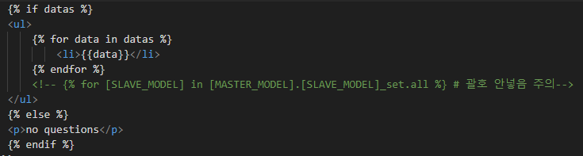
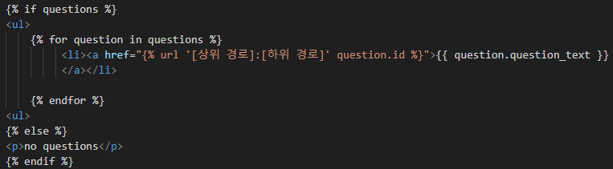
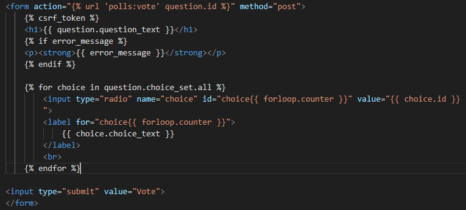

## 특징

- Django 내에서 time을 사용할 때에는 ```from django.utils import timezone```을 사용하는 것이 좋다.

<br/>

## Server 환경설정

1. 설치 : ```py -m pip install Django```
2. 프로젝트 생성 : ```django-admin startproject [NEW_PROJECT_NAME]```
3. 앱 생성 : ```python manage.py startapp [NEW_APP_NAME]```
4. server 실행 : ```python manage.py runserver```

<br/>

## API

1. 앱의 API 작성 : [APP_NAME] > views.py에 아래와 같이 작성 <br/>

```python
# views.py

############# Version 1. #############
# from django.http import HttpResponse

# def index(request):
#   pass

# def detail(request, data_id):
#   pass

# def some_url(request):
#     return HttpResponse("Some url을 구현해봤습니다.")

############# Version 2. #############
# from rest_framework.decorators import api_view
# from polls.models import Question
# from polls_api.serializers import QuestionSerializer
# from rest_framework.response import Response
# from rest_framework import status

# @api_view(['GET','POST'])
# def question_list(request):
#     if request.method == 'GET':
#         questions = Question.objects.all()
#         serializer = QuestionSerializer(questions, many = True)
#         return Response(serializer.data)
    
#     if request.method == 'POST':
#         serializer = QuestionSerializer(data=request.data)
#         if serializer.is_valid():
#             serializer.save()
#             return Response(serializer.data, status=status.HTTP_201_CREATED)
#         else:
#             return Response(serializer.errors, status=status.HTTP_400_BAD_REQUEST)

############# Version 3. #############
# from rest_framework.views import APIView

# class QuestionList(APIView):
#     def get(self, request):
#         questions = Question.objects.all()
#         serializer = QuestionSerializer(questions, many=True)
#         return Response(serializer.data)

#     def post(self, request):
#         serializer = QuestionSerializer(data=request.data)
#         if serializer.is_valid():
#             serializer.save()
#             return Response(serializer.data, status=status.HTTP_201_CREATED)
#         return Response(serializer.errors, status=status.HTTP_400_BAD_REQUEST)

# class QuestionDetail(APIView):
#     def get(self, request, id):
#         question = get_object_or_404(Question, pk=id)
#         serializer = QuestionSerializer(question)
#         return Response(serializer.data)

#     def put(self, request, id):
#         question = get_object_or_404(Question, pk=id)
#         serializer = QuestionSerializer(question, data=request.data)
#         if serializer.is_valid():
#             serializer.save()
#             return Response(serializer.data, status=status.HTTP_200_OK)
#         else:    
#             return Response(serializer.errors, status=status.HTTP_400_BAD_REQUEST)
        
#     def delete(self, request, id):
#         question = get_object_or_404(Question, pk=id)
#         question.delete()
#         return Response(status=status.HTTP_204_NO_CONTENT)

############# Version 4. #############
# from polls.models import Question
# from polls_api.serializers import QuestionSerializer
# from rest_framework import mixins
# from rest_framework import generics

# class QuestionList(mixins.ListModelMixin,
#                   mixins.CreateModelMixin,
#                   generics.GenericAPIView):
#     queryset = Question.objects.all()
#     serializer_class = QuestionSerializer

#     def get(self, request, *args, **kwargs):
#         return self.list(request, *args, **kwargs)

#     def post(self, request, *args, **kwargs):
#         return self.create(request, *args, **kwargs)

# class QuestionDetail(mixins.RetrieveModelMixin,
#                     mixins.UpdateModelMixin,
#                     mixins.DestroyModelMixin,
#                     generics.GenericAPIView):
#     queryset = Question.objects.all()
#     serializer_class = QuestionSerializer

#     def get(self, request, *args, **kwargs):
#         return self.retrieve(request, *args, **kwargs)

#     def put(self, request, *args, **kwargs):
#         return self.update(request, *args, **kwargs)

#     def delete(self, request, *args, **kwargs):
#         return self.destroy(request, *args, **kwargs)

############# Version 5. #############
from polls.models import Question
from polls_api.serializers import QuestionSerializer
from rest_framework import generics

class QuestionList(generics.ListCreateAPIView):
    queryset = Question.objects.all()
    serializer_class = QuestionSerializer

class QuestionDetail(generics.RetrieveUpdateDestroyAPIView):
    queryset = Question.objects.all()
    serializer_class = QuestionSerializer
```

2. 앱의 API 등록 : [APP_NAME] > urls.py에 아래와 같이 등록 <br/>

```python
from django.urls import path
from . import views

############# Version 1. #############
# urlpatterns = [
#     path('', views.index, name='index'),
#     path('<[자료형]:[DATA_ID]>/', views.details, name='detail'),
#     path('some_url', views.some_url)
# ]

############# Version 4. #############
from django.urls import path
from .views import *

urlpatterns = [
    path('question/', QuestionList.as_view(), name='question-list'),
    path('question/<int:pk>/', QuestionDetail.as_view(), name='question-detail'),
]
```

3. 프로젝트에 앱의 API 등록 : [PROJECT_NAME] > urls.py에 아래와 같이 등록 <br/>

```python
from django.contrib import admin
from django.urls import path, include

urlpatterns = [
    path('[APP_NAME]/', include('[APP_NAME].urls')),
    path('admin/', admin.site.urls)
]
```

### Serialize

**Serialize** : 모델 인스턴스나 QuerySet과 같은 데이터를 JSON 형식의 파일로 변환하는 작업 <br/>
**DeSerialize** : JSON 형식의 데이터를 정의된 포맷에 맞추어 다시 모델 인스턴스로 변환하는 작업 <br/>

#### Serializer의 정의

```python
# [APP_NAME]_api/serializers.py

from rest_framework import serializers
from polls.models import Question

class QuestionSerializer(serializers.ModelSerializer):
    class Meta:
        model = Question
        fields = ['id','question_text', 'pub_date']

# 위 코드는 아래와 같은 기능을 자동생성 함.

# class QuestionSerializer(serializers.Serializer):
#     id = serializers.IntegerField(read_only=True)
#     question_text = serializers.CharField(max_length=200)
#     pub_date = serializers.DateTimeField(read_only=True)

#     def create(self, validated_data):
#         return Question.objects.create(**validated_data)
#         # Question.objects.create(key=validated_data.key, value=validated_data.value)

#     def update(self, instance, validated_data):
#         instance.question_text = validated_data.get('question_text', instance.question_text)
#         instance.save()
#         return instance
```

#### Serializer의 사용 on Shell

```shell
> from polls.models import Question
> from polls_api.serializers import QuestionSerializer
> q = Question.objects.first()
> serializer = QuestionSerializer(q, many=False)
> serializer.data

> from rest_framework.renderers import JSONRenderer
> json_str = JSONRenderer().render(serializer.data)
> json_str

> import json
> data = json.loads(json_str)
> serializer = QuestionSerializer(data=data)
> serializer.is_valid() # 유효성 검사(Mapping 가능한지 스키마 검사)
> serializer.validated_data
> new_question = serializer.save()
> new_question
```

<br/>

## Django Shell

- 접속 : ```python manage.py shell```
- 종료 : exit
- 상태(변경사항) 자동 업데이트 안됨.

### on Shell
**모델 확인하기**
```shell
> from [APP_NAME].models import *
> model = [MODEL_NAME].objects.all()[0] 
# [MODEL_NAME].objects.first()
# [MODEL_NAME].objects.last()
> model.[FIELD_NAME]

# JOIN된 Model이 있는 경우
> model.[마스터 테이블과 연결된 FOREIGN_KEY].[MODEL_NAME]_set.all() => 마스터 테이블과 연결된 모든 현재 모델 인스턴스(오브젝트)들 반환
```

<br/>

## Model 생성 과정

1. model.py에 model 클래스 작성
  ex.
  ```python
  class Question(models.Model):
    question_text = models.CharField(max_length=200)
    pub_date = models.DateTimeField(auto_now=True)
    # auto_now : 데이터 생성시 시간 자동 부여
    # auto_now_add : model 생성시 시간 자동 부여

    def was_published_recently(self):
      return self.pub_date >= timezone.now() - datetime.timedelta(days=1)

    # 데이터의 대표적 표시 방법
    def __str__(self):
      if self.was_published_recently():
        new_badge = 'NEW!'
      else:
        new_badge = ''
      return f'{new_badge}, title: {self.question_text}'
  ```
2. ```python manage.py makemigrations```
  - migration 상태 확인 : ```python manage.py sqlmigra```
  - unique id 자동 생성됨
3. ```python manage.py migrate```

<br/>

## Model Fields
명세 위치 : Django Docs > The model layer

- BooleanField
- CharField
- DateField : 날짜만 저장. 시간 저장 안됨.
- DateTimeField : 날짜와 시간을 저장.
- FloatField
- JSONField
- TextField

<br/>

## Model 상태 변경

**마이그레이션 버전 되돌리기**
  1. ```python manage.py migrate [APP_NAME] [돌아가고자 하는 MIGRATION_INITIAL]```
  2. APP_NAME > migrations > [되돌아가기 전 MIGRATION_INITIAL]_initial.py 파일 삭제
  3. Model.py의 내용을 이전 버전 스키마와 일치시켜주기

<br/>

## DB

- Shell 접속 : ```sqlite3 db.sqlite3```
- Shell 종료 : ctrl + D

### on Shell
- 테이블 목록 조회 : .tables
- 테이블 스키마 확인 : .schema [테이블명]
- 쿼리문을 작성하여 데이터 조작

<br/>

## CRUD

- *QuerySet, filter method('__method')에 관한 명세 위치 : Django Docs > The model layer
  + __regex라는 filter method는 SQL의 REGEXP 키워드와 같은 기능을 하며 세부적인 filtering에 강력하다.

### admin(시스템 관리자) 대상
1. admin 계정 생성 : ```python manage.py createsuperuser```
2. APP_NAME > admin.py에 admin이 다룰 수 있는 모델(=Table) 등록
  ```admin.site.register([MODEL_NAME])```

#### on Shell
**모델 오브젝트(데이터) 생성/저장**
```shell
> from [APP_NAME].models import *
> q1 = [Model_NAME]([Field_NAME] = "")
> q1.save()

# JOIN된 Model이 있는 경우
> q1.[SLAVE_MODEL_NAME]_set.create([SLAVE_MODEL_FIELD_NAME] = '')
```

**모델 오브젝트(데이터) 조회**
```shell
> from [APP_NAME].models import *
> data = [MODEL_NAME].objects.get([FIELD_NAME]='')
> data = [MODEL_NAME].objects.get([FIELD_NAME]__startswith='')
> data = [MODEL_NAME].objects.get([FIELD_NAME]__[FILTER_METHOD]=30)

# filtering
> [MODEL_NAME].objects.filter([FIELD_NAME]__[FILTER_METHOD]=2024).count() # QuerySet을 반환하는 함수들에 대해서는 집계 기능을 사용할 수 있다.
> [MODEL_NAME].objects.filter([FIELD_NAME]__[FILTER_METHOD]=2024).query => 명령문과 같은 기능의 쿼리문을 반환
> [MASTER_MODEL_NAME].[SLAVE_MODEL_NAME].all().query => SELECT * FROM [SLAVE_MODEL_NAME] WHERE [SLAVE_MODEL_NAME].[FOREIGN_KEY] = [MASTER_MODEL_NUMBER] 반환
> [MODEL_NAME].objects.exclude([FIELD_NAME]__[FILTER_METHOD]=2024) => filter 조건을 만족하지 않는 데이터들(not filtering) 반환

# Model 관계 기반 filtering
> [SLAVE_MODEL_NAME].objects.filter([MASTER_MODEL_NAME]__[MASTER_FIELD_NAME]__[FILTER_METHOD]='').query => SELECT * FROM [SLAVE_MODEL_NAME] INNER JOIN [MASTER_MODEL_NAME] ON ([JOIN_CONDITION]) WHERE [FILTER_METHOD와 같은 기능을 하는 필터 쿼리문]
```

**모델 오브젝트(데이터) 수정**

```shell
> from [APP_NAME].models import *
> data = [MODEL_NAME].objects.last()
> data.[FIELD_NAME] = '수정하고 싶은 내용'
> data.save()

# filtering + update
> [MODEL_NAME].objects.filter([FIELD_NAME]__[FILTER_METHOD].update([FIELD_NAME]='수정하고 싶은 내용')) # Filter method를 만족하는 모든 데이터에 대해 수정을 수행
```

**모델 오브젝트(데이터) 삭제**

```shell
> from [APP_NAME].models import *
> data = [MODEL_NAME].objects.last()
> data.delete() # DB에서만 삭제(data 변수는 살아있음)

# JOIN된 Model이 있는 경우(MASTER, SLAVE 모두 끊기)
> [MASTER_MODEL_INSTANCE].[SLAVE_MODEL_NAME]_set.delete()

# filtering + delete
> [MODEL_NAME].objects.filter([FIELD_NAME]='filter하고 싶은 범위').delete() # Filter method를 만족하는 모든 데이터에 대해 삭제를 수행
```

#### Admin 데이터 편집 페이지 커스터마이징

```python
# [APP_NAME] > admin.py

from django.contrib import admin
from .models import Choice, Question

admin.site.register(Choice)

class ChoiceInline(admin.TabularInline):
    model = Choice
    extra = 3


class QuestionAdmin(admin.ModelAdmin):
    fieldsets = [
        ('질문 섹션', {'fields': ['question_text']}),
        ('생성일', {'fields': ['pub_date'], 'classes': ['collapse']}),        
    ]
    readonly_fields = ['pub_date']
    inlines = [ChoiceInline]
    list_filter = ['pub_date']
    search_fields = ['question_text', 'choice__choice_text']
    
admin.site.register(Question, QuestionAdmin)
```

```python
#[APP_NAME] > models.py

import datetime
from django.db import models
from django.utils import timezone
from django.contrib import admin


class Question(models.Model):
    question_text = models.CharField(max_length=200, verbose='질문')
    pub_date = models.DateTimeField(auto_now_add=True, verbose='생성일')  

    @admin.display(boolean=True, description='최근생성(하루기준)')
    def was_published_recently(self):
        return self.pub_date >= timezone.now() - datetime.timedelta(days=1)
    
    def __str__(self):
        return f'제목: {self.question_text}, 날짜: {self.pub_date}
```

<br/>

## View & Template

1. template 작성
  - templates > [APP_NAME] 위치에 index.html과 같이 작성



2. [APP_NAME] > views.py 작성

```python
from .models import *
from django.shortcuts import render

def index(request):
  latest_data_list = [MODEL_NAME].objects.order_by('-[FIELD_NAME]')[:5]
  context = {'datas': latest_data_list}
  return render(request, '[APP_NAME]/index.html', context)
```

<br/>

## URL 활용

### URL Pattern
**[APP_NAME] > urls.py** <br/>

```python
from django.urls import path 
from . import views  

app_name = '[상위 경로]'

urlpatterns = [     
    path('', views.index, name='index'),
    path('some_url', views.some_url), 
    path('<int:question_id>/', views.detail, name='[하위 경로]'),     
]
```

**[APP_NAME] > templates > [APP_NAME] > index.html** <br/>



### Redirection(302)
+ ```from django.http import HttpResponseRedirect```
+ ```django.urls import reverse```
+ 되돌아가기 예시 : ```HttpResponseRedirect(reverse('[상위 경로]:[하위 경로]', args = (arg1,)))``` -> ```<form action="" method="post">```

## HTML 활용

- **forloop.counter**
- **csrf_token**



<br/>

## Error 방어

**[APP_NAME] > views.py** <br/>

- ```from django.http import Http404``` : ```raise Http404('Does not exist')```
- ```from django.shortcuts import get_object_or_404``` : ```get_object_or_404([MODEL_NAME], [FILTER])```
- ```django.db.models import F``` : ```F([FIELD_NAME]) + 1```


<br/>
<br/>
<br/>

<hr/>

**ref.**<br/>
- Programmers DevCourse 3기

<hr/>