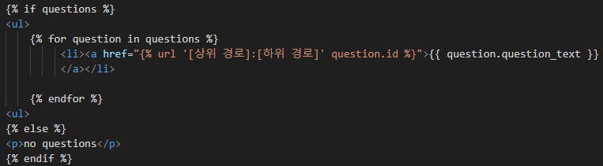
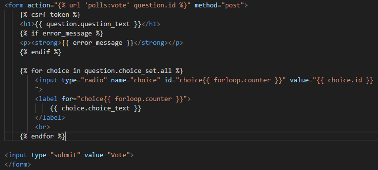

## View & Template

1. template 작성
  - templates/[APP_NAME] 위치에 index.html과 같이 작성


2. [APP_NAME]/views.py 작성

```python
from .models import *
from django.shortcuts import render

def index(request):
  latest_data_list = [MODEL_NAME].objects.order_by('-[FIELD_NAME]')[:5]
  context = {'datas': latest_data_list}
  return render(request, '[APP_NAME]/index.html', context)
```

<br/>

## URL 활용

### URL Pattern

**[APP_NAME]/urls.py**

```python
from django.urls import path 
from . import views  

app_name = '[상위 경로]'

urlpatterns = [     
    path('', views.index, name='index'),
    path('some_url', views.some_url), 
    path('<int:question_id>/', views.detail, name='[하위 경로]'),     
]
```

**[APP_NAME]/templates/[APP_NAME]/index.html**



### Redirection(302)
+ `from django.http import HttpResponseRedirect`
+ `django.urls import reverse`
+ 되돌아가기 예시 : `HttpResponseRedirect(reverse('[상위 경로]:[하위 경로]', args = (arg1,)))`

## HTML 활용

- **forloop.counter**
- **csrf_token**



<br/>

## Error 방어

**[APP_NAME] > views.py** <br/>

- `from django.http import Http404` : `raise Http404('Does not exist')`
- `from django.shortcuts import get_object_or_404` : `get_object_or_404([MODEL_NAME], [FILTER])`
- `django.db.models import F` : `F([FIELD_NAME]) + 1`


<br/>
<br/>
<br/>

<hr/>

**ref.**<br/>
- Programmers DevCourse 3기

<hr/>