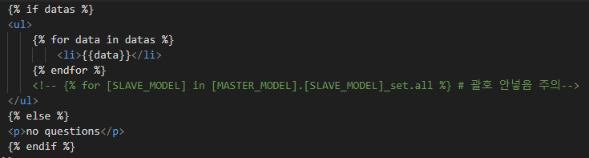

## View & Template

1. template 작성
  - templates/[APP_NAME] 위치에 index.html과 같이 작성



2. [APP_NAME]/views.py 작성

```python
from .models import *
from django.shortcuts import render

def index(request):
  latest_data_list = [MODEL_NAME].objects.order_by('-[FIELD_NAME]')[:5]
  context = {'datas': latest_data_list}
  return render(request, '[APP_NAME]/index.html', context)
```


<br/>
<br/>
<br/>

<hr/>

**ref.**<br/>
- Programmers DevCourse 3기

<hr/>