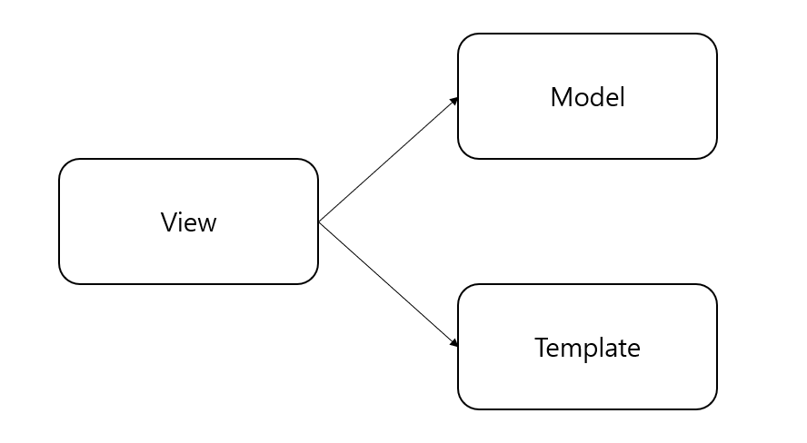
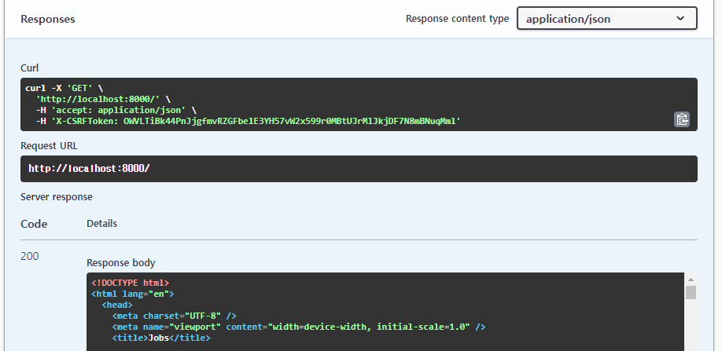
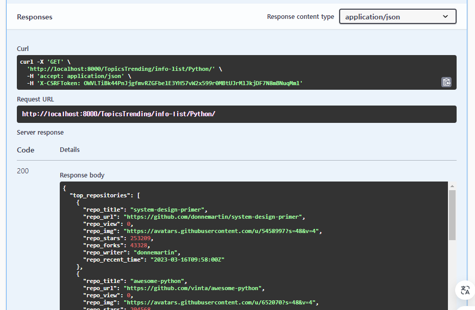

Django의 View와 Template 간 소통 방식을 이해하고,<br/>
프론트엔드와 백엔드의 소통 방식인 API 명세에 대해 생각해보기 위해 작성된 글입니다.<br/>

> 개인적인 경험을 바탕으로 작성된 글이므로 오류가 있을 수 있으니 참고만 해주시고 틀린 부분 정정 요청해주시면 감사하겠습니다.

우선 기본적인 Django의 View와 Template이 사용되는 방법은 아래와 같습니다.

```python
# view.py

from django.shortcuts import render

def my_view(request):
    my_data = "Hello, Django!"
    context = {'greeting': my_data}
    return render(request, 'my_template.html', context)
```

```html
<!--my_template.html-->

<!DOCTYPE html>
<html>
<head>
    <title>My Django Page</title>
</head>
<body>
    <p>{{ greeting }}</p>
</body>
</html>
```

즉, View는 사용자 요청을 처리하는 데 필요한 로직을 처리하는 역할을 하는 곳으로서 데이터 검색하고, 작업을 수행하고, 표시해야 하는 정보를 준비합니다. 위의 코드에서는 표시해야 하는 정보로서 my_template이라는 html에 greeting이라는 데이터를 담아 준비하고 렌더링해줍니다.<br/>
<br/>
django.shortcuts의 render 함수의 동작 원리를 간략히 요약해보면 아래와 같습니다.<br/>

1. 인자로 받은 html 파일 이름으로 html 파일을 찾습니다.
2. 인자로 받은 context를 1에서 찾은 html 파일에 적용시킵니다.
3. 2의 작업이 완료되어 완성된 html 파일을 클라이언트에게 전송합니다.

이렇게 View가 Template을 가져다 써야 하기 때문에 아래와 같이 Django의 MTV 패턴에서는 View가 Template을 바라보는 종속관계로 표시되는 것입니다.



그렇다면, 클라이언트의 이벤트(버튼 클릭 등)에 따라 반응하는 과정은 어떻게 될까요?<br/>
여기에서 렌더링 방식이 2가지가 있다는 것을 유의해야 합니다.<br/>

### SSR(Server-Side Rendering)

지금까지 위에서 설명했던 방식처럼 서버 측에서 html 페이지를 직접 생성해서 그대로 클라이언트에게 전달해주는 방식이 SSR의 기본적 상황 중 하나입니다. django.shortcuts의 render 함수를 사용하는 것은 SSR을 전제로 하게 되는 것이죠.<br/>
<br/>
아래와 같은 form의 사용 사례도 SSR 방식이 됩니다.<br/>

```html
<form method="post" action="{퍼센트 url 'submit_data' 퍼센트}">
    
    <input type="text" name="user_input" placeholder="Enter something...">
    <button type="submit">Submit</button>
</form>
```

```python
from django.shortcuts import render, redirect

def submit_data(request):
    if request.method == 'POST':
        user_input = request.POST.get('user_input')
        # Process the input or modify the data accordingly
        # For example, saving it to the database or modifying what will be displayed
        # Redirect to a new URL where the updated data is shown
        return redirect('results_page', input=user_input)
    return render(request, 'input_page.html')
```

SSR의 특징은 새로고침이 된다는 것입니다. 여기서 새로고침이란, 클라이언트가 보고 있는 웹페이지의 html 전체가 업데이트 된다는 것입니다. 우리가 웹브라우저에서 새로고침 버튼을 누를 때와 같이요. 그래서 웹페이지의 일부 컴포넌트만 업데이트하여 효율적이고 자연스러운 시각화가 필요한 상황이라면 CSR을 고려하게 됩니다.<br/>

> 넘어가기 전! 'SSR의 사용성은?'
> 1. 초기 페이지 로드
> 2. SEO 및 데이터가 클라이언트에 전송되기 전에 완전히 렌더링되어야 하는 경우

### CSR(Client-Side Rendering)

클라이언트 측에서 렌더링을 수행한다는 CSR은 주로 '전체 페이지를 자주 다시 로드하지 않고도 UI가 동적이고 반응성이 좋아야 하는 대화형 애플리케이션'에 유용합니다. 즉, 새로고침 없이 원하는 부분을 업데이트할 수 있습니다.<br/>
CSR의 경우 사용자 브라우저에서 실행되는 JavaScript에 많이 의존합니다. 클라이언트는 웹브라우저의 백그라운드에서 구동되는 JavaScript 코드에 의해 서버에 필요한 부분을 요청하고 받아 처리(렌더링)하게 됩니다. 처리 과정을 요약해보자면 아래와 같습니다.

1. 브라우저를 통해 사용자 입력을 캡처합니다.
2. JavaScript에서 HTTP 요청(AJAX, fetch, jquery 등의 방법 사용)을 서버에 보냅니다.
3. 서버는 요청받은 데이터를 JSON 형식으로 준비하여 클라이언트에게 HTTP 응답을 전송합니다.
4. 클라이언트 웹브라우저의 백그라운드에서 구동중인 JavaScript에서 응답을 받고 이를 html에 적용하여 수정합니다.

*HTTP는 통신 프로토콜이므로 더 정확하게 말하자면 '준비한 데이터를 HTTP 규칙을 이용해서 요청, 응답 해준다.'가 되겠습니다.<br/>
*웹브라우저의 백그라운드에서 이러한 통신 과정이 비동기적으로 이루어지기 때문에 그동안의 화면 동작에는 영향이 없어 보입니다.<br/>
<br/>

Django에서는 이러한 CSR이 아래와 같이 사용될 수 있습니다.<br/>

```html
<!--my_template.html-->

<script src="https://ajax.googleapis.com/ajax/libs/jquery/3.5.1/jquery.min.js"></script>
<script>
$(document).ready(function() {
    $('form').on('submit', function(e) {
        e.preventDefault();  // Prevent form from submitting normally
        $.ajax({
            type: 'POST',
            url: "{퍼센트 url 'submit_data' 퍼센트}",
            data: {
                'user_input': $('input[name="user_input"]').val(),
                'csrfmiddlewaretoken': $('input[name="csrfmiddlewaretoken"]').val()
            },
            success: function(response) {
                $('#response').html(response); // Assuming you have an element with ID 'response'
            }
        });
    });
});
</script>
```

```python
# view.py

from django.http import JsonResponse

def submit_data(request):
    if request.method == 'POST':
        user_input = request.POST.get('user_input')
        # Process the input
        response_data = {'message': 'You entered: {}'.format(user_input)}
        return JsonResponse(response_data)
```

### API 명세와 프론트엔드, 백엔드의 소통

위의 개념을 기반으로 프론트엔드와 백엔드가 원활히 소통하기 위한 API 명세를 어떻게 작성해야 할지 생각해보겠습니다.<br/>
<br/>
먼저 SSR 방식을 사용할 때의 View에서의 return과 Swagger를 통해 본 실제 response 내용입니다.

```python
return render(request, 'index.html', context)
```



html 파일 자체가 response body로 담겨져 응답되는 것을 알 수 있습니다. 이러한 경우, 백엔드의 View 작성자는 return에서 보내줘야할 html 파일의 명과 그 html에 어떤 데이터를 담아서 보내줘야 할지를 알아야하기 때문에 해당 API에 대한 response 명세에는 이 두가지 정보를 적어줘야 합니다.<br/>
<br/>

CSR 방식을 사용하는 경우의 View에서의 return과 Swagger를 통해본 실제 response 내용은 아래와 같습니다.

```python
return Response(job_count_skill) # JsonResponse
```



SSR 때와는 달리 json 형태의 데이터가 반환되는 것을 볼 수 있습니다. 이러한 경우, 백엔드의 View 작성자는 return에서 보내줘야할 json 형식의 데이터만 알면 되기 때문에 이 API의 response에 대한 명세에는 프론트엔드에서 필요로 하는 데이터를 json 형식으로 적어주면 될 것 같습니다.

<br/>
먼저 각 템플릿에 대해 SSR, CSR 렌더링 방식을 결정하고 이에 따라 API 명세의 response가 달라져야 함을 알 수 있습니다.

<br/>
<br/>
<br/>

<hr/>

**ref.**<br/>
- Programmers DevCourse 3기

<hr/>